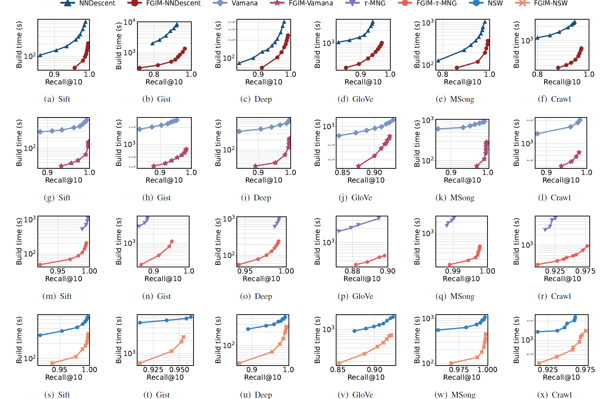

# Fast Graph-based Indexes Merging for Approximate Nearest Neighbor Search

## Contents:

- [Introduction](#introduction)
- [Usage](#usage)
  - [Environment](#environment)
  - [Running the code](#run-the-code)
  - [Extensibility](#extensibility)
- [Performance](#performance)
  - [Datasets](#datasets)
  - [Compared methods](#compared-methods)
  - [Results](#results)
- [License](#license)

## Introduction

This repository contains the source code for the paper "Fast Graph-based Indexes Merging for Approximate Nearest Neighbor Search". In the paper, we propose a framework for merging multiple indexes into a single index that can be used for ANNS.

## Usage

### Environment

- GCC 11.4.0
- CMake 3.29
- OpenMP 4.5

### Run the code

Change the dataset path and the metric in the `tests/test_index_construct.cpp` and `tests/test_merging_implemented_algorithms.cpp` files if you want to use your own dataset.

If you don't have the dataset, you can download the SIFT1M dataset with the following command:

```bash
python3 dataset.py
```

Then, compile on Ubuntu 22.04:

```bash
$ sudo apt-get install g++ cmake libomp-dev
$ git clone https://github.com/Mingle-2012/pg-fast-merging.git
$ cd pg-fast-merging
$ mkdir build && cd build
$ cmake ..
$ make -j
```

We provide three test files:

- `test_index_construction.cpp` - test the construction of NNDescent, Vamana, $\tau$-MNG, and NSW indexes.
- `test_merging_implemented_algorithms.cpp` - test the merging of the above indexes. (2 sub-graphs)
- `test_merging_graphs.cpp` - test the merging of given graphs. (2 sub-graphs)

Here are the examples of running the test files:

```bash
cd tests
$ ./test_index_construction <algorithm>
$ ./test_merging_implemented_algorithms <M0> <L> <M>
$ ./test_merging_graphs <graph 1> <dataset 1> <graph 2> <dataset 2> <metric> <output>
```

> The graph structure is formatted as follows:
> 
> [number of vertices]
> 
> [number of neighbors of vertex 1] [neighbor 1] [distance 1] [neighbor 2] [distance 2] ...
> 
> [number of neighbors of vertex 2] [neighbor 1] [distance 1] [neighbor 2] [distance 2] ...
> 
> ...

### Parameters

Merging parameters:

- `M0` - the initial out-degree of the merged index.
- `L` - the search pool size, which controls the quality of the search results, the larger the better but slower
- `M` - the final out-degree of the merged index.

Search parameters:

- `K` - the number of nearest neighbors to search for.
- `L` - the search pool size.

### Extensibility

Implement other refinement approaches in the `merge.cpp` file.

## Performance

### Datasets

| Dataset | #Points   | #Dimensions | #Queries |
|---------|-----------|-------------|----------|
| SIFT1M  | 1,000,000 | 128         | 10,000   |
| GIST1M  | 1,000,000 | 960         | 1,000    |
| DEEP1M  | 1,000,000 | 96          | 10,000   |
| MSong   | 994,185   | 420         | 1,000    |
| GloVe   | 1,183,514 | 100         | 10,000   |
| Crawl   | 1,989,995 | 300         | 10,000   |

- For the SIFT1M and GIST1M datasets, you can download them from the [TEXMEX](http://corpus-texmex.irisa.fr/) website.
- Thanks to [Yusuke Matsui](https://github.com/matsui528), you can download the DEEP1M dataset from his [repository](https://github.com/matsui528/deep1b_gt).
- For the MSong dataset, you can download it from the [CUHK-GQR](https://www.cse.cuhk.edu.hk/systems/hash/gqr/datasets.html)
- Thanks to the authors of [SSG](https://github.com/ZJULearning/SSG), you can download the Crawl, GloVe datasets from their repository.

### Compared methods

[NNDescent](https://dl.acm.org/doi/abs/10.1145/1963405.1963487)

[Tau-MNG](https://dl.acm.org/doi/abs/10.1145/3588908)

[DiskANN](https://github.com/microsoft/DiskANN)

[NSW](https://github.com/nmslib/nmslib)

### Results

In the experiments, we constructed two indexes in advance. FGIM significantly reduced time consumption compared to reconstructing a new index from scratch.



## License

All source code is made available under a MIT license. You can freely
use and modify the code, without warranty, so long as you provide attribution
to the authors. See `LICENSE` for the full license text.
